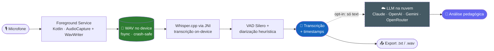

<div align="center">


# AulaLogger

### Grave, transcreva e analise aulas de 4 horas — inteiro no seu celular, sem nuvem.
### Record, transcribe and analyze 4-hour lectures — entirely on your phone, no cloud.

<br/>

[](#-instalação)
[](#-arquitetura)
[](#-arquitetura)
[](#-privacidade-em-3-frases)
[-6366F1)](CHANGELOG.md)
[](LICENSE)
[](#-privacidade-em-3-frases)

**[🌐 aulalogger.com.br](https://aulalogger.com.br)** · **[📥 Baixar APK](https://github.com/caioross/AulaLogger/releases/latest)** · **[📖 Documentação](docs/)**

🇧🇷 [**Português**](#-português) · 🇺🇸 [**English**](#-english)

</div>

---

<a name="-português"></a>

## 🇧🇷 Português

> **AulaLogger** grava aulas de **4 horas ou mais** sem travar, transcreve o áudio com o Whisper rodando **dentro do próprio aparelho** e gera uma análise pedagógica da aula. O áudio **nunca sai do celular** — a transcrição acontece offline, e só o *texto* vai para a nuvem se (e quando) você decidir.

### 🎯 O problema que ele resolve

Quem dá aula conhece a dor: gravar 4 horas no celular é pedir por desastre — o app trava, a bateria some, o arquivo corrompe. E mesmo quando dá certo, sobra um `.wav` gigante que ninguém vai reouvir. Os apps que transcrevem (Otter, Fireflies) mandam tudo para a nuvem, cobram por minuto e foram pensados para *reunião corporativa* — não para uma aula de Excel de 4 horas com 30 alunos cujas vozes não deveriam vazar.

**AulaLogger preenche essa lacuna:** transforma a aula em conhecimento pesquisável **sem depender de nuvem, assinatura ou da boa vontade da sua conexão.**

### ✨ O que ele faz hoje

|   | Recurso | Como funciona de verdade |
|---|---------|--------------------------|
| 🎙️ | **Gravação que não falha** | Foreground service nativo grava `WAV PCM 16 kHz` com `fsync` periódico. Se o app crashar no minuto 178, você recupera tudo até o último segundo. Suporta ~17 h contínuas. Pause/resume, widget na tela inicial e monitor de bateria/disco/microfone. |
| 📝 | **Transcrição on-device** | [Whisper.cpp](https://github.com/ggerganov/whisper.cpp) compilado via JNI (`arm64-v8a`/`armeabi-v7a`). Três modelos (181 / 514 / 574 MB) escolhidos automaticamente pela RAM do aparelho. VAD do Silero pula silêncios (30–50 % mais rápido). **Sem upload, sem custo por minuto, funciona em modo avião.** |
| 🗣️ | **Separa quem falou** | Diarização heurística por pausas marca "Locutor A / Locutor B" no transcript. *(Diarização real por embedding de voz está no roadmap.)* |
| 🧠 | **Análise pedagógica com IA** | Envie o *texto* da transcrição para o provedor que **você** escolher (Claude, OpenAI, Gemini ou OpenRouter) com **sua própria chave** — e receba tema, tópicos, resumo, pontos fortes, pontos a melhorar e sugestões. As chaves ficam cifradas no Android Keystore (AES-256-GCM). |
| 🔒 | **Privacidade real** | Zero telemetria, zero analytics, zero servidor próprio. O áudio nunca sai do aparelho. `allowBackup=false`. Open source, GPL-3.0. |

### 🔐 Privacidade em 3 frases

1. **O áudio nunca sai do seu celular.** Gravação e transcrição são 100 % locais.
2. **A nuvem é opt-in.** Só o *texto* da transcrição é enviado, só se você ligar a análise em nuvem, só para o provedor que você escolheu, com a sua chave.
3. **Não há o que vazar do nosso lado.** O AulaLogger não tem servidor, não coleta nada, não tem telemetria.

### 📱 Veja funcionando

> Capturas de tela: [`site/`](site/) · landing oficial em **[aulalogger.com.br](https://aulalogger.com.br)**

```
        ╭───────────────────────────╮
        │         01:23:45          │   ← cronômetro da sessão
        │        ● ● ● ● ●  REC      │
        │   ▁▃▅▇▅▃▁▂▄▆█▆▄▂▁▃▅▇▅▃▁    │   ← waveform ao vivo (nível RMS)
        │                           │
        │   💾 último save há 8 s    │   ← honestidade visual
        │   🔋 87 %  ·  💿 12,4 GB   │
        │                           │
        │     [ ⏸ Pausar ]  [ ⏹ ]    │
        ╰───────────────────────────╯
```

### 🏗 Arquitetura



**Stack real:**

| Camada | Tecnologia |
|--------|-----------|
| App | **Kotlin 2.0 + Jetpack Compose (Material 3)** — 100 % nativo, sem React Native |
| Transcrição | **whisper.cpp** compilado com NDK/CMake (OpenMP, `-O3`, dotprod) via JNI |
| IA de análise | Cloud opcional (BYO key): Anthropic Claude · OpenAI · Google Gemini · OpenRouter |
| Persistência | Arquivos `WAV` + metadados; chaves no Android Keystore |
| Mínimos | Android 10 (API 29) · ~4 GB RAM p/ transcrição · arm64/arm32 |
| Site | **Astro 5 + Tailwind**, estático, Cloudflare Pages |

### 🚦 Status & roadmap

**Beta em desenvolvimento ativo (v0.7.4).** O que já está sólido e o que vem a seguir:

- [x] **Gravação confiável** — 4 h+, crash recovery, widget, monitores *(pronto e testado)*
- [x] **Transcrição on-device** — Whisper.cpp/JNI, 3 modelos, VAD, ETA real *(pronto)*
- [x] **Análise pedagógica** — via cloud com sua chave (Claude/OpenAI/Gemini/OpenRouter) *(pronto)*
- [x] **Diarização heurística** — separação por pausas, rótulos editáveis *(pronto)*
- [ ] **Diarização real** — embedding de voz + enrollment do professor *(planejado)*
- [ ] **LLM 100 % local** — Gemma/Phi on-device, análise sem nuvem nenhuma *(planejado)*
- [ ] **Export rico** — PDF, DOCX, SRT, VTT, JSON *(planejado)*
- [ ] **F-Droid + keystore de produção** *(planejado)*

> Histórico completo em [`CHANGELOG.md`](CHANGELOG.md). Planejamento técnico: 14 documentos em [`docs/`](docs/) + 2 relatórios de auditoria.

### 📥 Instalação

1. Baixe o APK mais recente em **[GitHub Releases](https://github.com/caioross/AulaLogger/releases/latest)** (ou pela [página de download](https://aulalogger.com.br/download)).
2. No Android, habilite **"instalar apps desconhecidos"** para o seu navegador.
3. Abra o APK, conceda **microfone**, **notificações** e **ignorar otimização de bateria** (essencial para gravações longas).

> ⚠️ Builds atuais são *debug-signed* para teste. Um keystore de produção chega junto com a publicação no F-Droid.

### 🛠 Rodando o código

```bash
# App (Android nativo — requer JDK 17, Android SDK 35 e NDK 25.1.8937393)
cd app
./gradlew assembleDebug         # gera app/app/build/outputs/apk/debug/
#   ou simplesmente abra a pasta app/ no Android Studio e clique em Run ▶

# (opcional) baixar os modelos Whisper localmente
bash tools/download-models.sh

# Site (landing page)
cd site && npm install && npm run dev    # http://localhost:4321
```

### 📂 Estrutura do repositório

```
AulaLogger/
├── app/        → app Android nativo (Kotlin + Compose, com.aulalogger) + whisper.cpp (JNI/CMake)
├── site/       → landing page (Astro + Tailwind, deploy Cloudflare Pages)
├── docs/       → 14 documentos técnicos + 2 relatórios de auditoria
├── releases/   → histórico de APKs (v0.1.0 → v0.7.3)
├── tools/      → scripts (download de modelos, benchmark, áudio de teste)
├── .github/    → CI/CD (build, release, deploy) + templates de issue/PR
├── PLANO_DE_DESENVOLVIMENTO.md   → sumário executivo + roadmap em 1 página
└── CHANGELOG.md
```

### 🗺 Por onde começar a ler

| Tempo | Leia |
|-------|------|
| ⏱ 5 min | [`PLANO_DE_DESENVOLVIMENTO.md`](PLANO_DE_DESENVOLVIMENTO.md) — sumário + roadmap |
| ⏱ 30 min | + [`docs/01-visao-produto.md`](docs/01-visao-produto.md) e [`docs/02-arquitetura-tecnica.md`](docs/02-arquitetura-tecnica.md) |
| ⏱ 2 h | Tudo em [`docs/`](docs/), em ordem numérica |
| 💻 vou codar | [`docs/14-comecar-agora.md`](docs/14-comecar-agora.md) + [`BUILD.md`](BUILD.md) |

### 🛡 Princípios não-negociáveis

1. **Confiabilidade absoluta da gravação** — apertou "gravar", o áudio é capturado até apertar "parar". Ponto.
2. **Privacidade por padrão** — áudio nunca sai do device sem ação explícita; nuvem é opt-in.
3. **Funciona offline** — gravar e transcrever rodam em modo avião.
4. **Flexível ao conteúdo** — funciona igual para yoga, história ou Python.
5. **Recuperável a falhas** — crash no meio da aula não perde nada.
6. **Honestidade visual** — se a transcrição leva 1 h, mostramos "1 h restante", não "carregando…".
7. **Defaults sensatos, tudo configurável.**

### 🤝 Contribuindo

Issues, Discussions e PRs são bem-vindos. Veja [`CONTRIBUTING.md`](CONTRIBUTING.md), [`CODE_OF_CONDUCT.md`](CODE_OF_CONDUCT.md), [`SECURITY.md`](SECURITY.md) e [`BUILD.md`](BUILD.md).

### 📄 Licença

[GPL-3.0](LICENSE) © 2026 Caio e contribuidores do AulaLogger. Créditos de bibliotecas em [`CREDITS.md`](CREDITS.md).

---

<a name="-english"></a>

## 🇺🇸 English

> **AulaLogger** records **4-hour-plus** lectures without crashing, transcribes the audio with Whisper running **right on the device**, and produces a pedagogical analysis of the class. The audio **never leaves your phone** — transcription happens offline, and only the *text* goes to the cloud if and when you choose.

### 🎯 The problem it solves

Anyone who teaches knows the pain: recording 4 hours on a phone invites disaster — the app freezes, the battery dies, the file corrupts. And even when it works, you're left with a giant `.wav` nobody replays. Transcription apps (Otter, Fireflies) ship everything to the cloud, charge per minute, and were built for *corporate meetings* — not a 4-hour Excel class with 30 students whose voices shouldn't leak.

**AulaLogger fills that gap:** it turns a lecture into searchable knowledge **without depending on the cloud, a subscription, or the goodwill of your connection.**

### ✨ What it does today

|   | Feature | How it actually works |
|---|---------|-----------------------|
| 🎙️ | **Crash-proof recording** | A native foreground service writes `WAV PCM 16 kHz` with periodic `fsync`. If the app crashes at minute 178, you recover everything up to the last second. ~17 h continuous. Pause/resume, home-screen widget, battery/disk/mic monitors. |
| 📝 | **On-device transcription** | [Whisper.cpp](https://github.com/ggerganov/whisper.cpp) compiled via JNI. Three models (181 / 514 / 574 MB) auto-selected by device RAM. Silero VAD skips silence (30–50 % faster). **No upload, no per-minute cost, works on a plane.** |
| 🗣️ | **Knows who spoke** | Heuristic, pause-based diarization labels "Speaker A / Speaker B". *(Real voice-embedding diarization is on the roadmap.)* |
| 🧠 | **AI lecture analysis** | Send the transcript *text* to the provider **you** pick (Claude, OpenAI, Gemini or OpenRouter) with **your own key** — get theme, topics, summary, strengths, weak spots and suggestions. Keys are encrypted in the Android Keystore (AES-256-GCM). |
| 🔒 | **Real privacy** | Zero telemetry, zero analytics, no server of our own. Audio never leaves the device. Open source, GPL-3.0. |

### 🔐 Privacy in 3 sentences

1. **Audio never leaves your phone.** Recording and transcription are 100 % local.
2. **The cloud is opt-in.** Only transcript *text* is sent, only if you enable cloud analysis, only to the provider you chose, with your key.
3. **There's nothing to leak on our end.** AulaLogger has no server, collects nothing, has no telemetry.

### 🏗 Architecture & stack

A native Kotlin foreground service captures fail-safe audio → stored as WAV on device → whisper.cpp (JNI) transcribes on-device → Silero VAD + heuristic diarization → transcript with timestamps → *optional, opt-in* cloud LLM (Claude/OpenAI/Gemini/OpenRouter, text only) for pedagogical analysis → export.

| Layer | Technology |
|-------|-----------|
| App | **Kotlin 2.0 + Jetpack Compose (Material 3)** — 100 % native, no React Native |
| Transcription | **whisper.cpp** built with NDK/CMake (OpenMP, `-O3`, dotprod) via JNI |
| Analysis AI | Optional cloud (BYO key): Anthropic Claude · OpenAI · Google Gemini · OpenRouter |
| Minimums | Android 10 (API 29) · ~4 GB RAM for transcription · arm64/arm32 |
| Site | **Astro 5 + Tailwind**, static, Cloudflare Pages |

### 🚦 Status & roadmap

**Active beta (v0.7.4).** Done: reliable recording · on-device transcription · cloud-key pedagogical analysis · heuristic diarization. Planned: real voice-embedding diarization · fully local LLM (Gemma/Phi) · rich export (PDF/DOCX/SRT/VTT/JSON) · F-Droid + production keystore. Full history in [`CHANGELOG.md`](CHANGELOG.md).

### 📥 Install & run

Grab the latest APK from [GitHub Releases](https://github.com/caioross/AulaLogger/releases/latest), enable "install unknown apps" for your browser, and allow **microphone**, **notifications** and **ignore battery optimization**. To build from source: `cd app && ./gradlew assembleDebug` (needs JDK 17 + Android SDK 35 + NDK 25.1.8937393), or open `app/` in Android Studio. Site: `cd site && npm install && npm run dev`.

### 📄 License

[GPL-3.0](LICENSE) © 2026 Caio and the AulaLogger contributors.

---

<div align="center">

*Feito por **Caio** — instrutor de IA, Excel, Python e o que mais precisar virar aula.*
<br/>
*Built by **Caio** — instructor of AI, Excel, Python and whatever else needs to become a class.*

<br/>

**[⬆ Voltar ao topo](#aulalogger)**

</div>
