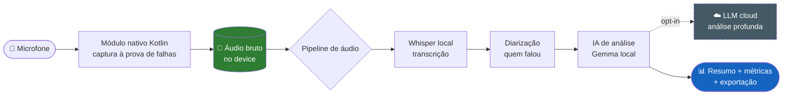

<div align="center">

# 🎙️ AulaLogger

**Grave, transcreva e analise aulas longas — 100% no seu celular, 100% offline.**
**Record, transcribe and analyze long lectures — 100% on your phone, 100% offline.**

[](#-instala%C3%A7%C3%A3o)
[](#-arquitetura)
[-FF6F00?logo=openai&logoColor=white)](#-arquitetura)
[](#-princ%C3%ADpios-n%C3%A3o-negoci%C3%A1veis)
[](releases/)
[](LICENSE)

🇧🇷 [**Português**](#-português) · 🇺🇸 [**English**](#-english)

</div>

---

<a name="-português"></a>

## 🇧🇷 Português

> Aplicativo Android (com landing page própria) que grava aulas de **4h+** sem falhar, transcreve o áudio com qualidade de estúdio **dentro do próprio aparelho**, identifica quem falou cada trecho e analisa a aula com IA — gerando resumos, tópicos e métricas pedagógicas. **Nada sai do celular** a menos que você mande.

### 🎯 O problema que ele resolve

Quem dá aula sabe: gravar 4 horas no celular é um pedido de desastre — o app trava, a bateria some, o arquivo corrompe. E mesmo quando dá certo, sobra um `.mp3` gigante que ninguém vai ouvir de novo. O AulaLogger nasceu para que **a aula vire conhecimento utilizável** sem depender de nuvem, assinatura ou da boa vontade da sua conexão.

### ✨ O que ele faz

| | Recurso | Detalhe |
|---|---|---|
| 🎤 | **Gravação à prova de falhas** | Sessões de 4h+ com gravação contínua, recuperação automática de crash e proteção contra perda de áudio. |
| 📝 | **Transcrição on-device** | Whisper rodando localmente — sem upload, sem custo por minuto, funciona no avião. |
| 🗣️ | **Diarização** | Separa automaticamente "você" dos "alunos" — saiba quem falou o quê. |
| 🧠 | **Análise pedagógica com IA** | Resumos, tópicos abordados, tempo de fala, alertas e métricas — IA local por padrão, nuvem só se você optar. |
| 🔒 | **Privacidade absoluta** | Offline-first. O áudio nunca deixa o aparelho sem uma ação explícita sua. |

### 🚦 Status do projeto

**Em desenvolvimento ativo.** O planejamento técnico está completo (16 documentos em [`docs/`](docs/)) e o app já tem builds internos rodando — a versão mais recente é a [**v0.7.3-redesign**](releases/). O esqueleto nativo (Kotlin), o app Expo/RN e o site Astro já existem e evoluem a cada release.

> 📌 Histórico completo de mudanças em [`CHANGELOG.md`](CHANGELOG.md).

### 🏗 Arquitetura



**Decisões já travadas:**

| # | Decisão | Escolha |
|---|---------|---------|
| D1 | Stack do app | React Native + Expo + módulo nativo Kotlin |
| D2 | Estratégia de IA | On-device (Whisper, Gemma) + nuvem opcional só para análise profunda |
| D3 | Distribuição | APK no site + GitHub Releases + F-Droid (sem Google Play na v1) |
| D4 | Escopo da v1 | Visão completa, faseada em v1.0 → v1.1 → v1.2 → v1.3 |

### 📂 Estrutura do repositório

```
AulaLogger/
├── app/          → aplicativo Expo + RN + módulo nativo Kotlin (com.aulalogger)
├── site/         → landing page e docs (Astro + Tailwind, Cloudflare Pages)
├── docs/         → 16 documentos técnicos (visão, arquitetura, pipeline, IA…)
├── releases/     → APKs gerados (até v0.7.3)
├── tools/        → scripts auxiliares (download de modelos ML, etc.)
├── PLANO_DE_DESENVOLVIMENTO.md   → sumário executivo + roadmap em 1 página
└── CHANGELOG.md  → histórico de versões
```

### 📥 Instalação

Baixe o APK mais recente da pasta [`releases/`](releases/) (ou da página de download do site) e instale no Android (habilite "fontes desconhecidas"). Builds são internos/de desenvolvimento — ainda não recomendados para uso em produção.

### 🛠 Rodando o código

```bash
# App (Expo / React Native)
cd app && npm install && npx expo run:android

# Site (Astro)
cd site && npm install && npm run dev   # http://localhost:4321
```

### 🗺 Por onde começar a ler

| Tempo | Leia |
|---|---|
| ⏱ 5 min | [`PLANO_DE_DESENVOLVIMENTO.md`](PLANO_DE_DESENVOLVIMENTO.md) — sumário + roadmap |
| ⏱ 30 min | + [`docs/01-visao-produto.md`](docs/01-visao-produto.md) e [`docs/02-arquitetura-tecnica.md`](docs/02-arquitetura-tecnica.md) |
| ⏱ 2 h | Tudo em [`docs/`](docs/), em ordem numérica |
| 💻 vou codar | [`docs/14-comecar-agora.md`](docs/14-comecar-agora.md) — guia da 1ª semana |

### 🛡 Princípios não-negociáveis

1. Confiabilidade absoluta da gravação
2. Privacidade por padrão (áudio nunca sai do device sem ação explícita)
3. Funciona offline
4. Flexível ao conteúdo
5. Recuperável a falhas
6. UI reversível e segura
7. Performance honesta
8. Defaults sensatos, tudo configurável

### 🤝 Contribuindo

Issues, Discussions e PRs são bem-vindos. Documentação em PT-BR (EN em progresso). Veja [`CONTRIBUTING.md`](CONTRIBUTING.md) e [`CODE_OF_CONDUCT.md`](CODE_OF_CONDUCT.md).

### 📄 Licença

[GPL-3.0](LICENSE) © 2026 Caio e contribuidores do AulaLogger.

---

<a name="-english"></a>

## 🇺🇸 English

> Android app (with its own landing page) that records **4h+** lectures without failing, transcribes the audio at studio quality **right on the device**, identifies who said each part, and analyzes the lecture with AI — generating summaries, topics and teaching metrics. **Nothing leaves your phone** unless you say so.

### 🎯 The problem it solves

Anyone who teaches knows the pain: recording 4 hours on a phone is asking for disaster — the app freezes, the battery dies, the file corrupts. And even when it works, you're left with a giant `.mp3` nobody will ever replay. AulaLogger exists to turn **a lecture into usable knowledge** without depending on the cloud, a subscription, or the goodwill of your connection.

### ✨ What it does

| | Feature | Detail |
|---|---|---|
| 🎤 | **Crash-proof recording** | 4h+ continuous sessions with automatic crash recovery and audio-loss protection. |
| 📝 | **On-device transcription** | Whisper running locally — no upload, no per-minute cost, works on a plane. |
| 🗣️ | **Diarization** | Automatically separates "you" from "students" — know who said what. |
| 🧠 | **AI lecture analysis** | Summaries, topics, talk time, alerts and metrics — local AI by default, cloud only if you opt in. |
| 🔒 | **Absolute privacy** | Offline-first. Audio never leaves the device without an explicit action. |

### 🚦 Project status

**Active development.** Technical planning is complete (16 documents in [`docs/`](docs/)) and the app already has internal builds running — the latest is [**v0.7.3-redesign**](releases/). The native Kotlin core, the Expo/RN app and the Astro site all exist and evolve with each release. See [`CHANGELOG.md`](CHANGELOG.md).

### 🏗 Architecture

See the diagram in the Portuguese section above. In short: a native Kotlin module captures audio fail-safe → stored locally → audio pipeline → local Whisper transcription → diarization → local Gemma analysis (optional cloud LLM for deep analysis) → summary, metrics & export.

**Locked-in decisions:** React Native + Expo + native Kotlin · on-device AI (Whisper, Gemma) with optional cloud · distribution via APK + GitHub Releases + F-Droid (no Play Store in v1) · phased v1.0 → v1.3 scope.

### 📥 Install & run

Grab the latest APK from [`releases/`](releases/) (dev builds — not production-ready yet). To run from source: `cd app && npm install && npx expo run:android` for the app, and `cd site && npm install && npm run dev` for the Astro landing page.

### 📄 License

[GPL-3.0](LICENSE) © 2026 Caio and the AulaLogger contributors.

---

<div align="center">

*Feito por **Caio** — instrutor de IA, Excel, Python e o que mais precisar virar aula.*
*Built by **Caio** — instructor of AI, Excel, Python and whatever else needs to become a class.*

</div>
